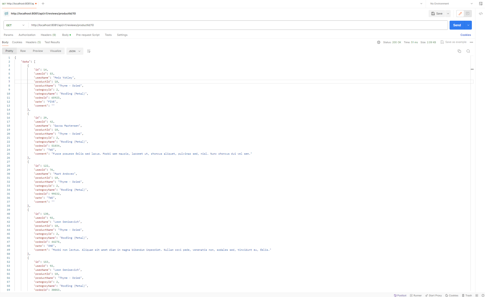

# E-Commerce

## Overview

This project is an e-commerce microservice architecture designed for an online marketplace. It consists of two main microservices: `ProductEngage` and `UserEngage`. The `ProductEngage` microservice is responsible for managing products, including their categories, details, and statuses. The `UserEngage` microservice handles user-related functionalities such as user information, coupons, and reviews. This architecture aims to provide a scalable and efficient system for managing an e-commerce platform's core functionalities.

### Key Features

- **Product Management**: Add, update, view, and delete products along with their categories. It also supports batch updates for product prices and status (active/inactive).
- **User Management**: Manage user information, including creation, updates, and deletion of user profiles. It supports gender and status fields for comprehensive user profiling.
- **Coupon Management**: Users can be associated with coupons, providing discounts or special offers. Coupons have validity periods and are linked to users.
- **Review Management**: Users can submit reviews for products, including ratings and comments. Reviews can be queried by user ID or product ID.
- **Category Information Retrieval**: Retrieve category information for products, facilitating organized product categorization and browsing.
- **Product Information Retrieval**: Fetch detailed product information, enhancing the shopping experience by providing comprehensive product details to users.

### Technologies Used

- **Spring Boot**: Framework for building stand-alone, production-grade Spring-based Applications.
- **Spring Data JPA**: Simplifies data access within databases, improving persistence and retrieval of data.
- **Spring Cloud OpenFeign**: For declarative REST client creation, facilitating communication between microservices.
- **H2 Database**: In-memory database for rapid prototyping and development phases.
- **Lombok**: Reduces boilerplate code for model/data objects.
- **MapStruct**: Facilitates object mapping, simplifying the conversion between different object models.
- **Springfox Swagger**: Integrates Swagger 2 for documenting RESTful APIs.

## Getting Started

### Prerequisites

- JDK 21 or above
- Maven 3.6 or above
- Spring Boot 3.2.2 or above

##  Architecture
The microservice architecture is designed to separate concerns, making the system more modular, scalable, and maintainable. The ProductEngage microservice focuses on product-related functionalities, while the UserEngage microservice handles user-centric operations, including user information, coupons, and reviews. These microservices communicate with each other via RESTful APIs, facilitated by Spring Cloud OpenFeign for seamless service-to-service communication. This architecture supports the deployment of services independently, allowing for easier updates, maintenance, and scalability of the e-commerce platform.

## Usage
###  Users
- Create User: POST /api/v1/users
- Get All Users: GET /api/v1/users
- Get User by ID: GET /api/v1/users/{id}
- Update User: PUT /api/v1/users/{id}
- Delete User: DELETE /api/v1/users/{id}
### Coupons
- Assign Coupon to User: POST /api/v1/userCoupons
- List Coupons for User: GET /api/v1/userCoupons/{userId}
- Delete Coupon: DELETE /api/v1/userCoupons/{id}/coupon
###  Reviews
- Submit Review: POST /api/v1/reviews
- List Reviews by User ID: GET /api/v1/reviews/userId/{userId}
- List Reviews by Product ID: GET /api/v1/reviews/productId/{productId}
- Get Review by ID: GET /api/v1/reviews/{id}
- Update Review by ID: PATCH /api/v1/reviews/{id}
### Categories
- Create Category: POST /api/v1/categories
- List All Categories: GET /api/v1/categories
- Get Category by ID: GET /api/v1/categories/{id}
- Update Category: PUT /api/v1/categories/{id}
- Delete Category: DELETE /api/v1/categories/{id}
### Products
- Create Product: POST /api/v1/products
- List All Products: GET /api/v1/products
- Get Product by ID: GET /api/v1/products/{id}
- Update Product: PUT /api/v1/products/{id}
- Delete Product: DELETE /api/v1/products/{id}

After you run the project, you can access more detailed documentation about APIs from this site with the Swagger UI implementation.
http://localhost:8080/swagger-ui.html

Example API:
